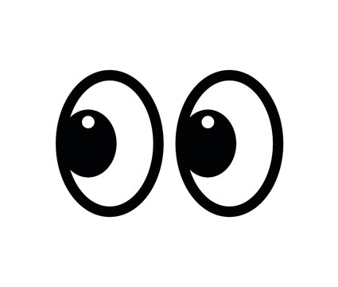

# Eye Movement Exercise 👀

## Description
Eyes created in CSS that will follow mouse movement🖱️around the page

### How to Run
* Download the zip and extract the files (Or fork the repository and fetch the files)
* Open the 'index.html'
* Move mouse around the page and watch the eyes 👀 follow

#### Improvements
* Added a galaxy background

#### Roadmap
* Add 'magic-shimmer.mp3' sound on page load ✨🎶
